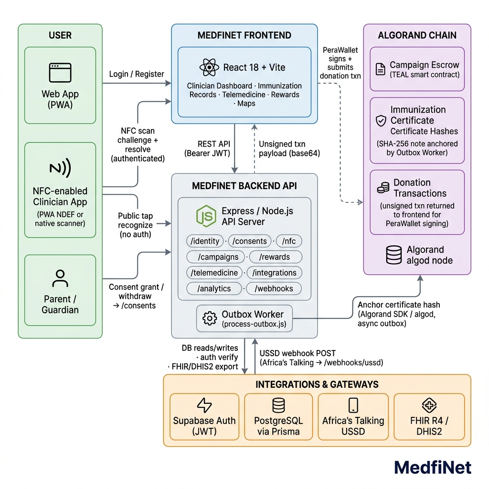

# MedfiNet Backend

**Track:** Health × Blockchain × Climate  
**Stack:** Node.js · Express · Prisma · PostgreSQL · Supabase · Algorand

MedfiNet is a consent-governed digital child identity and continuity-of-care platform for health, nutrition, and climate-emergency settings. This repository is the API server — it exposes versioned REST endpoints consumed by the MedfiNet frontend and third-party integrations (FHIR, DHIS2, Africa's Talking USSD).

---

## Vision & Impact

MedfiNet's mission is to ensure that every child's vaccination record, nutrition intake, and emergency-care history travels with them — across facility types, connectivity levels, and climate-disrupted geographies.

- Issue tamper-proof digital health certificates anchored on the Algorand blockchain.
- Govern cross-facility data sharing with patient-held, revocable consent tokens.
- Surface climate-response worklists that route field workers to the highest-risk children during emergencies.
- Deliver offline-resilient synchronization so facilities on 2G or USSD can stay current.

---

## Monorepo Roles

| Folder / Repo | Role | Primary Stack | Notable Outputs |
|---|---|---|---|
| **`medfinet_backend`** *(this repo)* | Versioned REST API, worker jobs, blockchain integration | Node.js, Express, Prisma, Algorand SDK | JWT auth, FHIR/DHIS2 bridge, NFC provisioning, USSD gateway |
| **`medfinet_frontend`** | Consumer and clinician web interface | React 18, Vite, TailwindCSS, Supabase JS | Immunization records, NFC tap, telemedicine, rewards dashboard |

---

## Architecture Overview



```
Browser / Mobile App
       │
       ▼
  Render (HTTPS)
       │
  Express API (app.js)
  ├── /api/v1/identity         — tenant identity & clinical continuity
  ├── /api/v1/campaigns        — crowdfunding campaigns & escrow
  ├── /api/v1/rewards          — token minting & settlement
  ├── /api/v1/notifications    — push / SMS dispatch
  ├── /api/v1/telemedicine     — consultation sessions
  ├── /api/v1/integrations     — FHIR R4, DHIS2 sync
  ├── /api/v1/analytics        — privacy-preserving aggregate metrics
  ├── /api/v1/governance       — localization & consent governance
  ├── /api/v1/webhooks         — Africa's Talking USSD ingress
  └── /api/v1/public           — open health-facility lookup
       │
  ┌────┴────────────────────┐
  │  Supabase Auth (JWT)    │
  │  PostgreSQL (Prisma)    │
  │  Algorand AVM           │
  │  Outbox Worker          │
  └─────────────────────────┘
```

### Key On-Chain Records

- **Campaign escrow contracts** — Algorand TEAL smart contracts lock donor funds until milestone verification.
- **Immunization certificate hashes** — SHA-256 digests anchored as Algorand Standard Asset notes for tamper-proof verification.
- **Reward token transfers** — On-chain settlement of health-compliance micro-incentives to patient Algorand wallets.

---

## Features

- **Supabase JWT Authentication** — Row-level security, token refresh, device-pepper identity binding.
- **Clinical Continuity** — Patient records, consent grants, and emergency access overrides.
- **USSD Gateway** — Africa's Talking integration for 2G / feature-phone health workers.
- **NFC Provisioning** — NTAG215 station registration and tap-event processing.
- **FHIR R4 / DHIS2 Bridge** — Standards-compliant interoperability exports.
- **Rewards & Settlement** — Token minting, wallet crediting, and accounting ledger.
- **Notifications** — Outbox-pattern worker for reliable push/SMS delivery.
- **Privacy-Preserving Analytics** — Aggregate-only reporting; no PII in query results.
- **Localization Governance** — Translation workflow with approval gating and audit trail.
- **Data Subject Requests** — GDPR/NDPR-aligned erasure and export workflows.
- **Climate-Response Worklists** — Priority queues for field workers in disaster zones.

---

## Installation

```bash
git clone https://github.com/Daniel419797/medfinet_backend.git
cd medfinet_backend
npm ci
```

---

## Configuration

Copy the example env file and fill in every placeholder:

```bash
cp .env.example .env
```

Key groups of variables:

| Group | Variables |
|---|---|
| **Database** | `DATABASE_URL` |
| **Supabase** | `SUPABASE_URL`, `SUPABASE_SERVICE_ROLE_KEY` |
| **Algorand** | `ALGOD_TOKEN`, `ALGOD_SERVER`, `ALGOD_PORT`, `INDEXER_SERVER` |
| **Security** | `JWT_SECRET`, `DEVICE_IDENTIFIER_PEPPER`, `REWARD_TOKEN_SECRET`, `NFC_UID_PEPPER` |
| **NFC** | `NFC_TAP_BASE_URL` (must be HTTPS in production), `NFC_PROVISIONING_SECRET` |
| **USSD** | `USSD_PROVIDER_CALLBACK_TOKEN`, `USSD_BACKEND_WEBHOOK_URL` |
| **Storage** | `NFT_STORAGE_KEY`, `WEB3_STORAGE_TOKEN` |
| **CORS** | `CORS_ORIGINS` (comma-separated list of allowed origins) |

> The API **refuses to start** in production while any placeholder value remains in the configuration.

---

## Scripts

| Command | Description |
|---|---|
| `npm run dev` | Start with nodemon (hot-reload) |
| `npm start` | Start in production mode |
| `npm test` | Run the Node test suite |
| `npm run check` | Syntax-check all source files |
| `npm run db:generate` | Regenerate Prisma client |
| `npm run db:migrate:deploy` | Apply pending migrations to the database |
| `npm run db:seed` | Seed reference data |
| `npm run worker` | Start the outbox delivery worker |
| `npm run ussd:ingress` | Start the USSD ingress gateway |

---

## Documentation

| Document | Description |
|---|---|
| [Configuration](./docs/configuration.md) | All environment variables with validation rules |
| [Developer Specification](./docs/developer-specification.md) | API design, auth flow, and data model |
| [Phase 1 Identity API](./docs/phase-1-identity-api.md) | Identity and clinical-continuity endpoint reference |
| [NFC Completion Audit](./docs/NFC_COMPLETION_AUDIT.md) | NFC integration coverage and test results |
| [NTAG215 Station Integration](./docs/NTAG215_STATION_INTEGRATION.md) | Hardware provisioning guide |
| [USSD Production Runbook](./docs/USSD_PRODUCTION_RUNBOOK.md) | Africa's Talking USSD deployment guide |
| [UNICEF Climate Ventures Plan](./docs/unicef-climate-ventures-readiness-plan.md) | Climate-response feature specification |
| [Production Requirements Matrix](./docs/production-requirements-matrix.md) | External gates and evidence tracking |

---

## Deployment

The backend is deployed on [Render](https://render.com) using the included `Dockerfile`.

1. Push to `main` — Render auto-deploys on new commits.
2. Set all required environment variables in **Render → Environment**.
3. Ensure `NFC_TAP_BASE_URL` uses `https://` (required in production).
4. Migrations run automatically via `start:production` (Prisma migrate → node app.js).

---

## Security

Never commit `.env`, database URLs, API tokens, wallet mnemonics, private keys, or identifiable child health information.  
Public blockchain records contain only non-identifying cryptographic proofs.

---

## Contact

For inquiries, partnerships, or collaboration opportunities reach out at **danieladedayooluwole@gmail.com**.

---

## License

This project does not include an open-source license and is considered **proprietary** by default.
